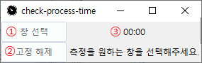

# 작업 시간 측정기
- [ENGLISH](README.md)
- [KOREAN](README-kr.md)

이 애플리케이션은 사용자가 선택한 프로세스의 활성 시간을 실시간으로 측정하고 표시합니다. 멀티태스킹 작업에 종사하는 개발자나 관리자들에게 특히 유용할 수 있습니다.


## 사전 요구사항 & 설치 방법
Python 3.x와 Tkinter 라이브러리(파이썬 표준 라이브러리에 포함)가 설치되어 있어야 합니다.

실행 가능한 파일 (.exe)로 컴파일하려면 PyInstaller도 필요합니다:
```shell
pip install pyinstaller
```

그런 다음 다음 명령을 실행하여 .exe 파일을 생성합니다:
```shell
pyinstaller --onefile --noconsole process-time-tracker.py
```


## 사용 방법


1. **창 선택**  
    '창 선택' 버튼을 클릭한 후, 3초 이내에 측정하려는 창을 선택합니다.
2. **상단 고정**  
    '상단 고정' 버튼을 사용하여 이 애플리케이션을 다른 창 위에 항상 표시할 수 있습니다.
3. **Window Active Time**  
    선택한 창의 활성 시간은 버튼 옆에 표시됩니다.


## 문제 해결
애플리케이션 사용 중 문제가 발생하는 경우 일반적인 문제와 해결 방법은 다음과 같습니다:

- **문제:** 애플리케이션이 시작되지 않습니다.
- **해결책:** Python 및 모든 필요한 라이브러리가 정확히 설치되어 있는지 확인하세요.
- **문제:** 추적 작업이 예상대로 작동하지 않습니다.
- **해결책:** 추적하기 위해 유효한 창을 선택했는지 확인하세요.

여기에 나열되지 않은 문제가 발생하면 GitHub에서 문제를 제기하고, 문제와 오류 메시지를 설명하세요.


## 기여
이 프로젝트에 대한 기여는 환영입니다! 다음 방법으로 기여할 수 있습니다:

- GitHub 이슈를 통해 버그 보고나 기능 요청을 제출합니다.
- 이 저장소를 포크하고 변경 사항을 포함하여 풀 리퀘스트를 생성합니다.

풀 리퀘스트를 제출하기 전에 코드가 기존 스타일을 따르며 모든 테스트가 통과하는지 확인하세요.


## 라이센스
이 프로젝트는 MIT 라이센스에 따라 라이선스됩니다 - 자세한 내용은 [LICENSE](LICENSE) 파일을 참조하세요.


## 연락
이 프로젝트에 대한 질문이나 피드백은 아래 연락처로 부담 없이 연락주세요:

Email: k_gyujin@daum.net
GitHub: [@kgyujin](https://github.com/kgyujin)