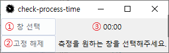

# Process Time Tracker
- [ENGLISH](README.md)
- [KOREAN](README-kr.md)

The Process Time Tracker is an application that measures and displays the active time of a user-selected process in real-time.  
This tool can be particularly useful for developers or administrators engaged in multitasking work.


## Prerequisites & Installation
You need to have Python 3.x and the Tkinter library (included in Python's standard library) installed on your machine.

To compile this application into an executable file (.exe), you'll also need PyInstaller:
```shell
pip install pyinstaller
```

Then, run the following command to create the .exe file:
```shell
pyinstaller --onefile --noconsole process-time-tracker.py
```


## Application Usage


1. **Select Window**  
    Click 'Select Window' button, then select a window you want to measure within 3 seconds.
2. **Always On Top**  
    You can use 'Always On Top' button to make this application stay always on top of other windows.
3. **Window Active Time**  
    The selected window's active time will be displayed next to button.


## Troubleshooting
If you encounter issues while using this application, here are some common problems and their solutions:

- **Problem:** The application doesn't start.
- **Solution:** Ensure that Python and all necessary libraries are correctly installed on your machine.
- **Problem:** The tracking doesn't work as expected.
- **Solution:** Make sure that you have selected a valid window for tracking.

If you encounter a problem not listed here, please open an issue on GitHub with a description of the problem and any error messages.


## Contributing
Contributions to this project are welcome! Here's how you can contribute:

- Submit bug reports or feature requests through GitHub issues.
- Fork this repository and create pull requests with your changes.

Before submitting a pull request, please ensure that your code follows the existing style and all tests pass.


## License
This project is licensed under the MIT License - see the [LICENSE](LICENSE) file for details.


## Contact Information
For any questions or feedback about this project, feel free to contact me at:

Email: k_gyujin@daum.net
GitHub: [@kgyujin](https://github.com/kgyujin)